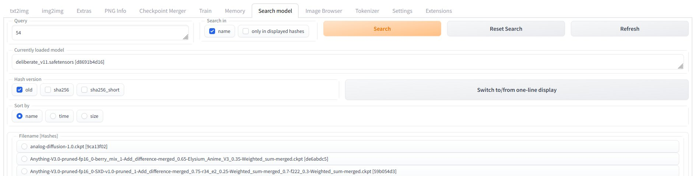

# Stable Diffusion extension: Search model

A custom extension for [AUTOMATIC1111/stable-diffusion-webui](https://github.com/AUTOMATIC1111/stable-diffusion-webui) to easier search for a model.

With more and more models I find it increasingly difficult to find the one with the right checksum to follow someone's prompt. In addition to that, by now there have been more than one version of the checkpoint algorithm.

To help with this a little, I wrote this simple extension.

The query wildcard-searches over all hash-versions and the filename. Results are filtered and the model can be directly loaded by clicking its radio button.

## Installation

The extension can be installed directly from within the **Extensions** tab within the Webui.

You can also install it manually by running the following command from within the webui directory:

	git clone https://github.com/AlUlkesh/sd_search_model/ extensions/sd_search_model

## Requirements
Requires at least commit [c1928cd](https://github.com/AUTOMATIC1111/stable-diffusion-webui/commit/c1928cdd6194928af0f53f70c51d59479b7025e2) of webui (2023-01-19) for full functionality.

## First run
The first run with this extension will take a bit longer, since the hashes for all models are calculated. One time only.

